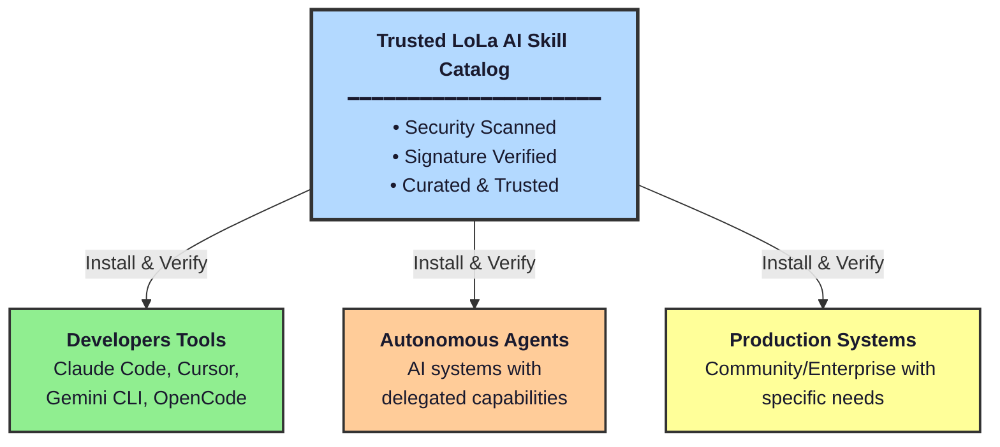
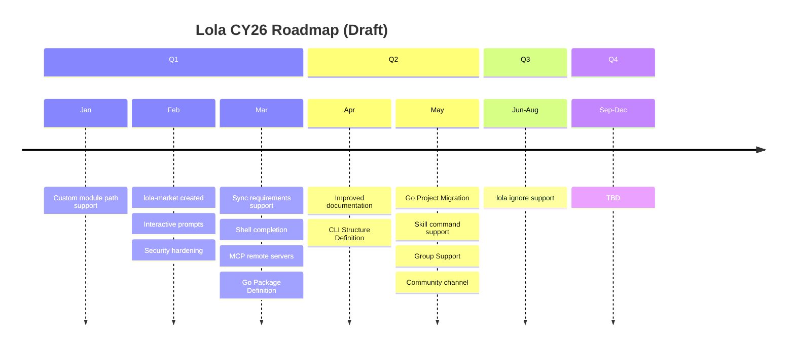

# Roadmap

## What Works Today

- 4 AI assistants supported (Claude Code, Cursor, Gemini CLI, OpenCode)
- Marketplace for skill discovery and distribution
- Declarative module management with `.lola-req`
- Install hooks for bootstrapping agents
- Open source under Apache-2.0

## Vision

Lola aims to be the de facto AI Package Manager - the standard for distributing skills and context to any AI agent, not just coding assistants.

### Universal Agent Support

Make Lola the standard for distributing context packages to ANY AI agent:

- **Any Assistant**: Claude Code, Cursor, Gemini CLI, and any new assistant that emerges
- **Any Autonomous Agent**: LangChain, CrewAI, AutoGen, or custom agent implementations
- **Any Framework**: MCP servers, agent orchestration platforms, and whatever the future brings
- **Full Bootstrap Automation**: Your AI agent's entire ICL context tree deployed as code

### Trusted Skill Catalogs and Security

As AI skills become a standard way to inject context into agents, they also become a vector for prompt injection attacks and supply chain compromises. Skills can contain executable scripts, and without verification, there is no way to validate their integrity or origin. We see this as a critical challenge that needs to be addressed before it becomes a crisis.

One of our core goals is to centralize skills behind a trusted and curated AI Skill Catalog. We recognize that attestation and verification are fundamental to making that work securely at scale.

This vision includes:

- **Skill Scanning**: Automated malicious code detection, vulnerability scanning for bundled scripts, and dependency auditing before publication
- **Signature Verification**: Cryptographic signatures for skills using standards like [Sigstore](https://www.sigstore.dev/), ensuring publisher identity verification and tamper detection - similar to RPM package signing
- **Provenance**: Attestation that skills originated from a trusted source and were built by a specific workflow, ensuring the full supply chain is verifiable
- **Trusted Catalogs**: Curated, verified collections of skills that serve as the single source of truth for enterprise-approved AI context

We envision Lola as part of a broader ecosystem of tools that can sign and attest skills, while Lola handles verification during installation. This is an open area of design and we welcome discussion - see [GitHub Issue #62](https://github.com/LobsterTrap/lola/issues/62) for the ongoing conversation.

### Go Migration

Lola's current Python implementation proved the concept. We are planning to migrate Lola to Go for improved performance, easier distribution as a single binary, and better alignment with the cloud-native ecosystem.

### Dependency Management

- Dependencies between skills and modules with the ability to sync and install the full dependency chain
- Version resolution across dependent modules

### Context Export

- Export the runtime context window from a coding agent to a Lola module
- Convert existing agent configurations into distributable packages

## CY26 Roadmap (Draft)

!!! warning "Draft"
    This roadmap is a working draft and serves as a high-level view for planning and discussions. Items, priorities, and timelines may change at any time without notice.

## Why This Matters

**For Developers**: Stop maintaining duplicate AI contexts. Switch AI tools freely without losing workflows. Install skills from trusted, verified catalogs.

**For Organizations**: Distribute knowledge to many AI agents. Update compliance requirements across all agents instantly. Enterprise security with only verified, scanned skills from trusted catalogs.

**For the Industry**: An open standard for sharing AI skills and context. Community-driven. Security-first, with built-in scanning and verification before it becomes a crisis.
