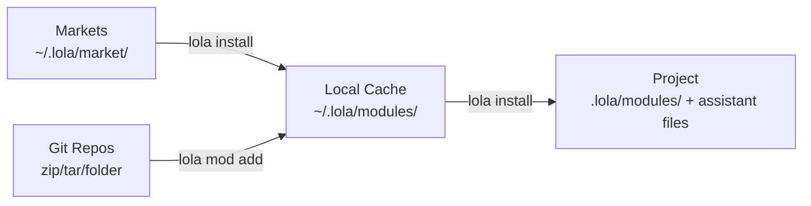

# Architecture

Lola is an AI Package Manager. It treats skills and context modules as packages that can be distributed to any AI agent - from coding assistants like Claude Code and Cursor, to standalone autonomous agents that need context injected at runtime. Just as DNF distributes RPM packages to Linux systems, Lola distributes AI context packages to agents.

While skills are becoming a standard for agent context (see [AgentSkills.io](https://agentskills.io/specification)), Lola goes beyond conversion between assistant formats. The goal is to be the de facto package manager for AI skills and context, enabling any agent - including standalone agents outside of coding assistants - to receive context packages at runtime. Features like install hooks support bootstrapping agents with scripts when installing or injecting new context.

Lola works similarly to [vim-plug](https://github.com/junegunn/vim-plug) for caching and installing, while mimicking the behavior of package managers like DNF, YUM, or APT for distribution and dependency management.

!!! note
    Lola currently uses the term "market" (or "marketplace") for its federated module catalogs. We are considering renaming this concept to "repository" or "repo" in a future release for better alignment with established package manager terminology.

## How Lola Works

Lola operates in three stages:

### Markets (`~/.lola/market/`)

Markets are federated, searchable lists of modules that point to source repositories. Unlike PyPI or npm which host packages centrally, Lola combines multiple markets into a unified search. Markets can be public, private, or local - making them ideal for enterprise teams who need trusted, curated lists of skills.

- `~/.lola/market/*.yml` - Market references (source URL + enabled state)
- `~/.lola/market/cache/*.yml` - Cached market content

When you install a module from a market, Lola transparently fetches it from the source repository, caches it locally, and installs it.

### Local Cache (`~/.lola/modules/`)

When a module is added (via `lola mod add` or through a market install), it gets cached in `~/.lola/modules/`. This cache is shared across all your projects. When you update a module (`lola mod update`), the cached files are re-fetched from the source and any projects using it can be reinstalled.

### Project Installation (`<project>/.lola/modules/`)

When installed into a project, Lola copies the module from the cache and generates assistant-specific files. Each project has independent copies and generated files.

The installation pipeline runs in this order:

1. **Module copy** -- module cached to `.lola/modules/<name>/`
2. **Pre-install hook** -- optional script from `lola.yaml`
3. **Module tree** -- full content tree copied to the target's `modules/<name>/` directory (e.g., `.claude/modules/<name>/`), preserving all internal paths for agent-accessible shared resources
4. **Skills** -- skill directories copied or registered per target format
5. **Commands** -- command files copied; file-based targets (Claude Code, Cursor, OpenCode) also copy co-named sidecar directories
6. **Agents** -- agent files generated with target-specific frontmatter and a plain-text preamble pointing to the installed module tree
7. **MCPs** -- MCP server configs merged into target config files
8. **Instructions** -- module instructions written to managed sections
9. **Post-install hook** -- optional script from `lola.yaml`

## Source Handlers

Lola uses a strategy pattern for fetching modules from different sources:

- **Git** - Clone with depth 1
- **Zip/Tar** - Local or remote archives
- **Folder** - Local directory copy
