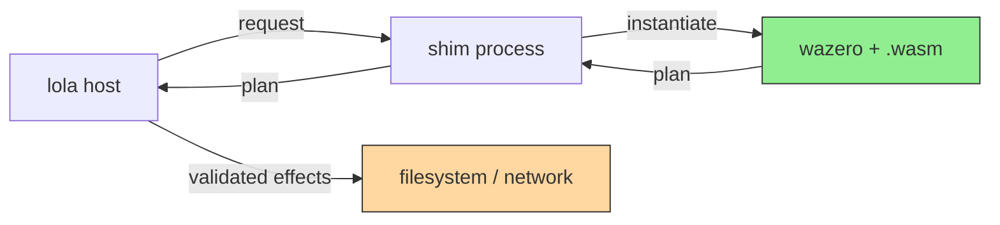

# Extension Sandboxing — Implementation Design

----
> 🦾 Written with LLM assistance [claude-opus-5]
> 💪 Reviewed by a human before submission
----

Paired with [ADR: Extension Sandboxing](../../adr/extension-sandboxing.md).

## The plan protocol

An extension never performs an effect. It receives a request and returns a
**plan**: a declarative description of what it wants to happen. The host
validates the plan and executes it.



Green = untrusted extension code. Orange = the only component that touches the
outside world, and it is host code.

### Plan shape

A plan is a list of intents. The host rejects any intent the extension lacks
capability for, and rejects the whole plan rather than applying it partially.

| Intent   | Fields                             | Used by                          |
|----------|------------------------------------|----------------------------------|
| `write`  | `path`, `mode`, `content`          | target extensions                |
| `delete` | `path`                             | target uninstall                 |
| `rename` | `from`, `to`                       | target migration between layouts |
| `fetch`  | `url`, `method`, `headers`, `dest` | source extensions                |
| `clone`  | `repo`, `ref`, `depth`, `dest`     | git source extensions            |

`fetch` and `clone` are executed by the host's own HTTP and `go-git` clients.
This is a security control and a feature: proxy configuration, credential
handling, TLS policy, retry, and cache behaviour are implemented once in the
host rather than reimplemented per source extension.

### Path validation

Every `path` in a plan is resolved against a root the host chose, then checked
to be within it after symlink resolution. Absolute paths, `..` traversal, and
symlinks escaping the root are rejected. Extensions never learn the absolute
root; they receive root-relative paths and return root-relative paths.

Plans are applied atomically: the host stages writes, verifies the complete
plan, then commits. A failure mid-apply rolls back to the pre-plan state.

## Capabilities

An extension declares what it needs in its manifest. The host grants exactly
that or refuses to load the extension. Absent declaration means no capability.

```yaml
capabilities:
  - net.http          # host performs the fetch; extension supplies the intent
  - net.git           # host performs the clone
```

| Capability | Grants                   | Notes                                               |
|------------|--------------------------|-----------------------------------------------------|
| *(none)*   | plan-only operation      | the expected case for target extensions             |
| `net.http` | `fetch` intents accepted | host executes; extension never opens a socket       |
| `net.git`  | `clone` intents accepted | host executes via `go-git`                          |
| `net.raw`  | direct socket access     | **tier 2 only**; cannot be granted to a WASM module |

There is no filesystem capability. Filesystem access is always mediated by the
plan.

## The shim

The host re-executes its own binary as a hidden subcommand:

```
lola __extension-host --module <path> --caps <granted>
```

The subcommand is registered on the root command with `Hidden: true` so it does
not appear in help or completion. The parent passes the request on the child's
stdin and reads the plan from its stdout; stderr is captured and surfaced as
extension diagnostics.

The child, in order:

1. Applies OS confinement. On Linux this is Landlock restricting the process to
   no filesystem access at all, since the WASM module receives its input over
   the pipe. On macOS and Windows this step is a no-op and the guarantee rests
   on wazero.
2. Instantiates the module with wazero, configured with no preopened
   directories, no environment variables, and no argv beyond what the request
   specifies.
3. Enforces limits: wall-clock timeout, memory ceiling, and a fuel budget so a
   module cannot spin forever.
4. Writes the plan to stdout and exits.

A child that exceeds any limit is killed and its plan discarded. Extension
failure never leaves partial state, because nothing was applied.

## Tiers

|            | Tier 1                              | Tier 2                                    |
|------------|-------------------------------------|-------------------------------------------|
| Artifact   | `.wasm` module                      | native binary                             |
| Runtime    | wazero, WASI preview 1              | OS process                                |
| Filesystem | none — plan-mediated                | none granted, **not enforced**            |
| Network    | `net.http` / `net.git` intents only | `net.raw` available                       |
| Install    | default                             | explicit opt-in, valid signature required |
| Listed as  | `wasm` in `lola ext ls`             | `native` in `lola ext ls`                 |

Tier 2 speaks the identical plan protocol over the identical pipe. The
difference is enforcement, not interface, which means an extension can be
promoted from tier 2 to tier 1 by recompiling, with no code change.

## Authoring toolchain

| Language   | Target                    | Notes                                                         |
|------------|---------------------------|---------------------------------------------------------------|
| Go         | `GOOS=wasip1 GOARCH=wasm` | native since Go 1.21                                          |
| Rust       | `wasm32-wasip1`           | `rustup target add wasm32-wasip1`                             |
| JavaScript | `javy`                    | compiles JS to a WASI p1 module via QuickJS; small artifacts  |
| Python     | **tier 2**                | CPython cannot target WASI p1 without shipping an interpreter |

The Python asymmetry is documented in user-facing docs rather than hidden. A
Python extension is a normal binary or script; it is signed, opt-in, and
reported as `native`.

## ABI

WASI preview 1 has no interface-type mechanism, so the module contract is Lola's
to define:

- The module exports `lola_run() -> i32`, returning a status code.
- The host writes the request into module memory before the call and reads the
  plan out after it, using two exported helpers, `lola_alloc(size) -> ptr` and
  `lola_plan_ptr() -> ptr`, following the pattern established by Extism.
- Request and plan are JSON. The volume is small (a module list and a file
  plan), so a binary encoding is not worth the tooling cost.
- The ABI carries a version integer. The host refuses modules whose ABI version
  it does not implement, with an error naming both versions.

## Testing

- **Plan validation** is unit-tested against hostile inputs directly: `..`
  traversal, absolute paths, symlinks pointing outside the root, and paths that
  only escape after the second resolution.
- **Confinement** is tested with purpose-built hostile modules — one that
  attempts to open `/etc/passwd`, one that attempts a socket, one that allocates
  without bound, one that never returns. Each must fail in the expected way, and
  each is a regression test.
- **Tier parity** is tested by compiling the same fixture extension to both
  tiers and asserting identical plans, which is what makes promotion a
  recompile.
- **Atomicity** is tested by injecting a failure partway through apply and
  asserting the tree matches its pre-plan state.
