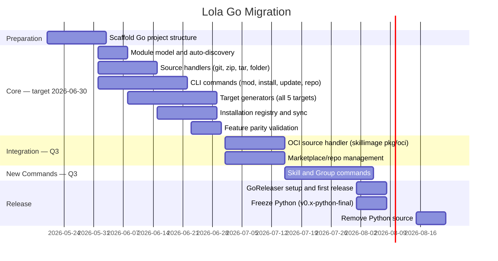

# Go Migration — Implementation Design

Paired with [ADR-0002: Go Migration](../../adr/0002-go-migration.md).

!!! note "Goal"
    The primary goal of this migration is **full 1:1 parity with the current Python CLI**.
    The guiding rule is: do not break the user experience — flag names, commands, and
    behavior must remain identical to the Python version until parity is reached. Some
    Q3 new commands (Skill, Group) are included here to capture and align future
    direction alongside the migration, but they are clearly annotated as additions beyond
    parity. Further improvement ideas — flag renames, UX enhancements — are tracked in
    the [Post-Parity Improvements](#post-parity-improvements) section for the next
    design cycle.

## Migration Timeline



## Coexistence Layout

During the transition, both Python and Go source live in the same repository:

```text
lola/
├── src/lola/              # ACTIVE during migration — frozen at v0.x-python-final once Go reaches parity
├── cmd/lola/main.go       # NEW — Go entry point
├── internal/              # NEW — Go private packages
├── pkg/                   # NEW — Go public packages
├── go.mod                 # NEW
├── go.sum                 # NEW
├── .goreleaser.yaml       # NEW
├── pyproject.toml         # FROZEN — Python build config
├── uv.lock                # FROZEN
└── tests/                 # Existing Python tests (frozen)
```

CI runs both test suites:
- Python: `pytest` (existing, frozen)
- Go: `go test ./...` (new, growing)

## Tech Stack Details

### Cobra Command Registration

Each command is a separate file in `internal/cli/` following the one-file-per-command pattern. The root command registers all subcommands explicitly:

```go
func NewRootCmd() *cobra.Command {
    root := &cobra.Command{Use: "lola"}
    root.AddCommand(
        // Migrated from Python CLI — target: Q2 end (2026-07)
        NewModCmd(),         // lola mod (add, rm, ls, info, update, search, init)
        NewInstallCmd(),     // lola install
        NewUninstallCmd(),   // lola uninstall
        NewUpdateCmd(),      // lola update
        NewListCmd(),        // lola list
        NewSyncCmd(),        // lola sync
        NewRepoCmd(),        // lola repo (renamed from market)
        NewCompletionsCmd(), // lola completions bash/zsh/fish

        // New commands — target: Q3 start (2026-08)
        NewSkillCmd(),  // lola skill — standalone skill management
        NewGroupCmd(),  // lola group — group install (dnf group-style bundles)
        // NewServeCmd() — deferred post-parity; needs dedicated design doc
    )
    return root
}
```

### Viper Configuration

Viper handles all configuration sources in priority order:
1. CLI flags (highest)
2. Environment variables (`LOLA_*` prefix)
3. Project config (`lola.yml` or `lola.toml`)
4. Global config (`~/.lola/config.yml`)
5. Defaults (lowest)

Viper brings YAML (`go.yaml.in/yaml/v3`) and TOML (`pelletier/go-toml/v2`) as its own transitive dependencies — no separate imports needed.

### skillimage Package Usage

```go
import (
    "github.com/redhat-et/skillimage/pkg/oci"
    "github.com/redhat-et/skillimage/pkg/skillcard"
    "github.com/redhat-et/skillimage/pkg/lifecycle"
)
```

The OCI source handler uses `pkg/oci` to pull and unpack skill images, `pkg/skillcard` to parse `skill.yaml` metadata alongside `SKILL.md` frontmatter, and `pkg/lifecycle` to check skill lifecycle state (warn before installing deprecated skills).

### Frontmatter Parser

Hand-rolled, no external dependency:

```go
func ParseFrontmatter(content []byte, v any) (body []byte, err error) {
    parts := bytes.SplitN(content, []byte("---"), 3)
    // Frontmatter must start at byte 0; a non-empty parts[0] means the first
    // "---" is mid-document (e.g. a horizontal rule), not an opening fence.
    if len(parts) < 3 || len(bytes.TrimSpace(parts[0])) > 0 {
        return content, nil
    }
    if err := yaml.Unmarshal(parts[1], v); err != nil {
        return nil, fmt.Errorf("parsing frontmatter: %w", err)
    }
    // TrimPrefix removes only the single newline after the closing "---",
    // preserving intentional blank lines at the start of the body.
    return bytes.TrimPrefix(parts[2], []byte("\n")), nil
}
```

## Python Feature Parity Checklist

!!! note "Scope"
    The primary goal of this checklist is 1:1 parity with the current Python CLI — flag
    names, behavior, and output are kept identical to avoid breaking existing users.
    Improvements such as flag renames (`--module-content` → `--content-path`,
    `--workspace` → `--install-root`) and UX enhancements are out of scope here and will
    be addressed in a follow-up design cycle once parity is reached. New commands planned
    for Q3 (Skill, Group) are included and clearly annotated as additions beyond parity.

Before removing Python source, the Go binary must pass:

**Commands**

- [ ] `lola mod add <source>` — git, zip, tar, folder, URL variants; `--module-content` flag (alias: `--content-path`)
- [ ] `lola mod rm [-f]`, `lola mod ls`, `lola mod info [-v]`, `lola mod update`
- [ ] `lola mod init` — with `--no-skill`, `--no-command`, `--no-agent`, `--no-mcps`, `--no-instructions`, `--force`
- [ ] `lola mod search <query>` — implement as a filtered view of a global search engine (repos only, matching current Python behavior); global search without filter is the foundation for universal search post-parity
- [ ] `lola install [MODULE] [-a ASSISTANT] [-f] [-v] [--scope project|user] [--append-context PATH] [--pre-install SCRIPT] [--post-install SCRIPT] [--workspace NAME] [PROJECT_PATH]`
- [ ] `lola uninstall <module> [-a ASSISTANT] [--scope project|user] [-v] [PROJECT_PATH]`
- [ ] `lola update [MODULE] [-a ASSISTANT] [-v]` — with orphan detection and removal for skills, commands, agents, and MCPs
- [ ] `lola list [--assistant ASSISTANT]`
- [ ] `lola sync [PROJECT_PATH] [-a ASSISTANT] [--dry-run] [-v]`
- [ ] `lola repo add/ls/set/rm/update` (renamed from `market`)
- [ ] `lola completions <bash|zsh|fish>` — shell completion scripts
- [ ] Shell completion for module names on `lola install` / `lola uninstall`

**Targets**

- [ ] All 5 targets: `claude-code`, `cursor`, `gemini-cli`, `openclaw`, `opencode`
- [ ] File-based target pattern (Claude Code, Cursor, OpenClaw) — skills, commands, agents written as individual files
- [ ] Managed-section target pattern (Gemini CLI, OpenCode) — skills appended to / removed from named sections inside `GEMINI.md` / `AGENTS.md`
- [ ] OpenClaw `--workspace` flag (named workspace directories)

**Module handling**

- [ ] Module content auto-discovery: `module/` → `lola-module/` → repo root (checked in order)
- [ ] `--module-content` override and `content_dirname` persistence in `source.yml`
- [ ] Single-skill layout (`SKILL.md` at root) and skill-pack layout (`skills/<name>/SKILL.md`)
- [ ] `AGENTS.md`, `commands/`, `agents/`, `mcps.json` auto-discovery within content dir
- [ ] `append_context` flag on install; persisted on `Installation` record; honoured on `lola update`
- [ ] Installation scope (`project` / `user`) on install, uninstall, and list

**Install behaviour**

- [ ] Pre/post install hook execution — detect both `lola.yml` and `lola.yaml`; honour `--pre-install` / `--post-install` overrides
- [ ] Interactive prompts: overwrite confirmation, multi-repo conflict picker (when module exists in more than one enabled repo)
- [ ] Skill name conflict resolution: when two installed modules share a skill name, the second is installed with a `<module>.<skill>` prefix to avoid overwriting the first
- [ ] Backwards-compatible uninstall: also removes old prefixed filenames (`<module>.<cmd>.md`, `<module>.<agent>.md`) left by installs made before the prefix was removed
- [ ] Auto-search enabled repos when a module is not found in the local registry — equivalent to `_fetch_from_marketplace()` in the Python CLI

**Sync**

- [ ] `.lola-req` parsing with [Version Specifiers](https://packaging.python.org/en/latest/specifications/version-specifiers/#version-specifiers) standard operators (`~=`, `==`, `!=`, `>=`, `<=`, `>`, `<`, `===`)
- [ ] `.lola-req` Lola-specific extensions: `~` tilde and `^` caret (converted to standard operators at parse time)
- [ ] `--dry-run` mode

**Data integrity**

- [ ] Installation registry persisted as YAML with atomic writes (write to temp file, rename)

## Post-Parity Improvements

Ideas raised during review to be addressed in the first Go improvement cycle after parity is reached. Not in scope for the 1:1 migration.

- **`--module-content` → `--content-path`**: Rename for clarity — reads as "fetch this source, load content from this subpath." During parity, implement both names in Cobra pointing to the same behaviour (`--module-content` as the parity alias, `--content-path` as the new name). No refactor needed post-parity.
- **`--workspace` (OpenClaw-specific)**: Remains tied to the OpenClaw target — not a global flag. Post-parity: expand workspace capabilities within the OpenClaw target extension.
- **Skill conflict resolution UX**: Current behavior silently prefixes conflicting skill names. Future improvement: prompt the user, support a `--prefix` flag, or allow `prefix:` configuration in `lola.yaml`.
- **Universal `mod search`**: Expose the global search engine without filters so users can search across both the local module registry and all enabled repos in a single command. The foundation is already built during parity (see checklist).
- **`lola serve`**: HTTP router for REST API and local repo serving (gin-gonic). Needs a dedicated design doc before implementation.
